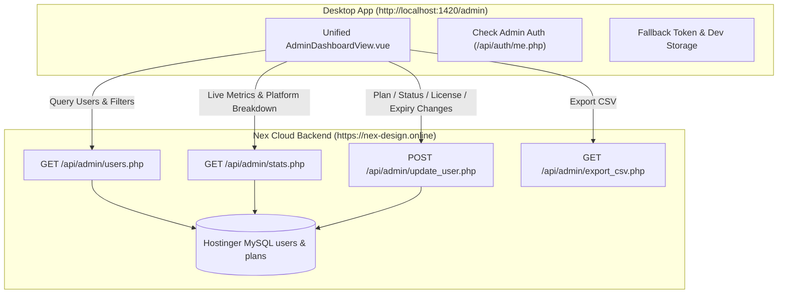

# Nex Design Studio — Admin Dashboard Unification & Deployment Guide
**Target Environments:** `http://localhost:1420/admin` & `https://nex-design.online/admin`  
**Architecture:** Vue 3 + Tailwind CSS + Live MySQL / PHP API Integration  
**Version:** 2.5.0

---

## 1. Overview & Architecture

This document specifies the unification and deployment steps to replace the desktop admin shell (`http://localhost:1420/admin`) with the full-featured, dark-ruby **Early Access & Package Management Console** from `https://nex-design.online/admin`.



---

## 2. Core Features & Controls

### 2.1 Live Statistics & Metrics
* **Total Registered:** Real-time queue count from `users` table.
* **University Students:** Count and percentage of total registrants.
* **Graduates & Pros:** Count and percentage of alumni / agency professionals.
* **Top Operating System:** Real-time breakdown across Windows (x64), macOS (Apple Silicon M-Series), macOS (Intel), and Linux.

### 2.2 Advanced Search & Multi-criteria Filtering
* **Search Query:** Instant search across User Name, Work/Student Email, University/Institution, and Faculty/Major.
* **Category Filter:** `All Categories`, `University Students`, `Graduates & Pros`.
* **Platform Filter:** `All Platforms`, `Windows (x64)`, `macOS (Apple Silicon)`, `macOS (Intel)`, `Linux (x64)`.
* **Status Filter:** `All Statuses`, `Active`, `Approved`, `Pending`, `Invited to Beta`, `Suspended`, `Restricted`.

### 2.3 User Entitlements & License Management Table
* **Queue Position:** Display sequential `#waitlist_number`.
* **User Profile & Environment:** Name, email, OS pill, university, and major.
* **Package Plan Selector:** Real-time plan update (`Starter Package`, `Professional Package`, `Teams Studio Package`).
* **Plan Expiration & Calendar Picker:** Real-time expiry indicator with 7 duration presets (`+30 Days`, `+90 Days`, `+120 Days`, `+180 Days`, `1 Year`, `Lifetime`, `Custom Date`).
* **Rust License Key Management:** Instant generation and revocation of cryptographic keys (`NEX-PRO-...`, `NEX-TEAM-...`, `NEX-STR-...`).
* **Status & Access Controls:** One-click activation, suspension, or restriction with custom reason notes.

### 2.4 Batch & Bulk Operations
* Multi-select row checkboxes with `Select All`.
* Bulk actions toolbar:
  * Bulk Plan assignment.
  * Bulk Status modification (`Approve All`, `Suspend All`).
  * Bulk Expiration extension.
  * Bulk License Key generation.

### 2.5 Data Export
* **CSV Export:** Real-time streaming export of all filtered or complete user records via `GET /api/admin/export_csv.php`.

---

## 3. Backend API Contract (`https://nex-design.online/api/admin/`)

### 3.1 Fetch Users (`GET /api/admin/users.php`)
**Query Parameters:**
* `page`: `number` (default: `1`)
* `limit`: `number` (default: `25`, max: `100`)
* `search`: `string`
* `user_type`: `'student' | 'graduate'`
* `preferred_os`: `'windows' | 'mac_arm' | 'mac_intel' | 'linux'`
* `status`: `'active' | 'approved' | 'pending' | 'invited_to_beta' | 'suspended' | 'restricted'`

**Response:**
```json
{
  "success": true,
  "data": {
    "users": [
      {
        "id": 13,
        "name": "Mahmoud Hassan",
        "email": "test.student.1788090378@cairo-univ.edu.eg",
        "role": "designer",
        "user_type": "student",
        "institution": "Cairo University",
        "faculty_major": "Computer Science",
        "graduation_year": 2026,
        "preferred_os": "windows",
        "status": "active",
        "waitlist_number": 13,
        "plan_slug": "starter",
        "plan_name": "Starter Package",
        "plan_expires_at": null,
        "license_key": "NEX-STR-990A-11BC"
      }
    ],
    "pagination": {
      "current_page": 1,
      "limit": 25,
      "total_records": 13,
      "total_pages": 1
    }
  }
}
```

### 3.2 Update User Plan / Status / Expiration (`POST /api/admin/update_user.php`)
**Payload:**
```json
{
  "user_id": 13,
  "plan_slug": "professional",
  "status": "active",
  "restriction_reason": null,
  "regenerate_key": false,
  "expiry_type": "3_months",
  "custom_expiry_date": null
}
```

---

## 4. Desktop Client Route Implementation (`src/views/AdminDashboardView.vue`)

The desktop route `/admin` connects directly to the live backend while supporting offline dev resilience:
* Queries `https://nex-design.online/api/admin/users.php` and `stats.php`.
* Dispatches mutations to `https://nex-design.online/api/admin/update_user.php`.
* Provides offline and local profile mock fallbacks when testing without active internet connectivity.
