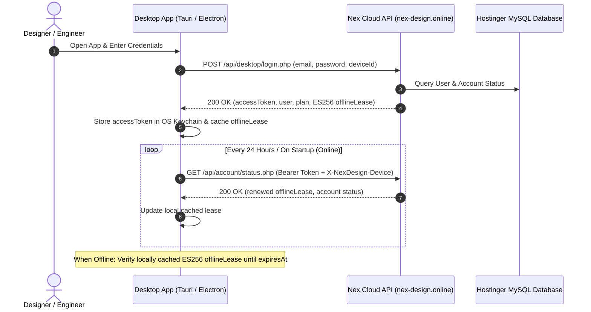

# Nex Design Studio — Desktop Application Integration Guide
**Version:** 2.4.0  
**Target Environment:** Production (`https://nex-design.online`)  
**Target Audience:** Desktop App Developers (Tauri / Rust / Electron / C++ / TypeScript)

---

## 1. Overview & Architecture

The **Nex Design Cloud Backend** provides authentication, entitlement verification, device-bound offline lease management, and license key validation for the **Nex Design Desktop Application**.



---

## 2. Global API Conventions

- **Base URL:** `https://nex-design.online/api`
- **Protocol:** HTTPS (TLS 1.3 / TLS 1.2)
- **Standard Request Headers:**
  ```http
  Content-Type: application/json
  Accept: application/json
  ```
- **Standard Response Envelope:**
  ```json
  {
    "success": true,
    "message": "Human readable status message",
    "data": { ... },
    "error": null,
    "errors": null
  }
  ```

---

## 3. API Endpoints Reference

### 3.1. Desktop Login & Activation
Authenticates the user, binds the session to the client hardware (`deviceId`), and issues an Access Token along with a cryptographically signed **ES256 Offline Lease**.

- **Endpoint:** `POST https://nex-design.online/api/desktop/login.php`
- **Auth Required:** No

#### Request Payload:
```json
{
  "email": "designer@studio.com",
  "password": "SecretPassword123!",
  "deviceId": "HWID-8F92-4A1B-99C1"
}
```

| Field | Type | Required | Description |
|---|---|---|---|
| `email` | `string` | **Yes** | User's registered email address. |
| `password` | `string` | **Yes** | User's account password. |
| `deviceId` | `string` | **Yes** | Persistent hardware identifier (MAC hash / Machine GUID / CPU ID). |

#### Response (200 OK):
```json
{
  "success": true,
  "message": "Desktop login successful.",
  "data": {
    "accessToken": "eyJ0eXAiOiJKV1QiLCJhbGciOiJIUzI1NiJ9.eyJpZCI6MTMsImVtYWlsIjoidGVzdEBleGFtcGxlLmNvbSIsInJvbGUiOiJ1c2VyIiwibmFtZSI6Ik1haG1vdWQiLCJpYXQiOjE3ODgwMjExMTcsImV4cCI6MTc5MDYxMzExN30.6wcm...",
    "accessTokenExpiresAt": 1790613117000,
    "user": {
      "accountId": "13",
      "name": "Mahmoud Hassan",
      "email": "designer@studio.com",
      "status": "active"
    },
    "plan": {
      "id": "starter",
      "name": "Starter Package"
    },
    "offlineLease": {
      "accountId": "13",
      "deviceId": "HWID-8F92-4A1B-99C1",
      "status": "active",
      "statusVersion": 1,
      "issuedAt": 1788021117000,
      "expiresAt": 1788625917000,
      "token": "eyJhbGciOiJFUzI1NiIsInR5cCI6IkpXVCJ9..."
    }
  }
}
```

---

### 3.2. Account Status & Lease Renewal
Validates the current session, verifies device integrity, and issues a renewed 7-day offline lease token.

- **Endpoint:** `GET https://nex-design.online/api/account/status.php`
- **Auth Required:** Bearer Token

#### Request Headers:
```http
Authorization: Bearer <accessToken>
X-NexDesign-Device: HWID-8F92-4A1B-99C1
```

#### Response (200 OK):
```json
{
  "success": true,
  "message": "",
  "data": {
    "accountId": "13",
    "email": "designer@studio.com",
    "status": "active",
    "statusVersion": 1,
    "offlineLease": {
      "accountId": "13",
      "deviceId": "HWID-8F92-4A1B-99C1",
      "status": "active",
      "statusVersion": 1,
      "issuedAt": 1788021117000,
      "expiresAt": 1788625917000,
      "token": "eyJhbGciOiJFUzI1NiIsInR5cCI6IkpXVCJ9..."
    }
  }
}
```

---

### 3.3. Verify Standalone License Key
Validates an offline/standalone license key (e.g. enterprise serial key or educational seat).

- **Endpoint:** `POST https://nex-design.online/api/desktop/verify_license.php`
- **Auth Required:** Optional / License Header

#### Request Payload:
```json
{
  "licenseKey": "NEX-STUDIO-2026-X891-BETA",
  "deviceId": "HWID-8F92-4A1B-99C1"
}
```

#### Response (200 OK):
```json
{
  "success": true,
  "message": "License key is active and valid.",
  "data": {
    "valid": true,
    "tier": "enterprise",
    "expiresAt": null
  }
}
```

---

### 3.4. Early-Access Account Registration (In-App Sign Up)
Allows users to create a student or graduate account directly from inside the desktop app if not yet registered.

- **Endpoint:** `POST https://nex-design.online/api/auth/register.php`
- **Auth Required:** No

#### Request Payload:
```json
{
  "name": "Sarah Connor",
  "email": "sarah@mit.edu",
  "password": "SecurePassword123!",
  "user_type": "student",
  "institution": "Massachusetts Institute of Technology",
  "faculty_major": "Design & Computer Science",
  "graduation_year": 2027,
  "student_id_number": "MIT-98212",
  "preferred_os": "mac_arm"
}
```

---

## 4. TypeScript Interfaces & Data Models

Copy these type definitions into your desktop codebase (`src/types/auth.ts` or `src-tauri/src/models.rs`):

```typescript
export type UserType = 'student' | 'graduate' | 'professional';
export type AccountStatus = 'active' | 'approved' | 'invited_to_beta' | 'pending' | 'suspended' | 'deactivated';
export type PreferredOS = 'windows' | 'mac_arm' | 'mac_intel' | 'linux';

export interface UserProfile {
  accountId: string;
  name: string;
  email: string;
  status: AccountStatus;
  userType?: UserType;
  institution?: string;
  facultyMajor?: string;
  waitlistNumber?: number;
}

export interface PlanEntitlement {
  id: 'starter' | 'pro' | 'enterprise';
  name: string;
}

export interface OfflineLeaseData {
  accountId: string;
  deviceId: string;
  status: 'active' | 'suspended' | 'deactivated';
  statusVersion: number;
  issuedAt: number;     // Milliseconds timestamp
  expiresAt: number;    // Milliseconds timestamp
  token: string;        // Signed ES256 JWT
}

export interface DesktopLoginResponse {
  accessToken: string;
  accessTokenExpiresAt: number;
  user: UserProfile;
  plan: PlanEntitlement;
  offlineLease: OfflineLeaseData;
}
```

---

## 5. Offline Lease Token Structure & Cryptography

The `offlineLease.token` returned by the server is a standard **ES256 (ECDSA using P-256 and SHA-256)** JSON Web Token.

### JWT Header:
```json
{
  "alg": "ES256",
  "typ": "JWT"
}
```

### JWT Claims Payload:
```json
{
  "accountId": "13",
  "deviceId": "HWID-8F92-4A1B-99C1",
  "status": "active",
  "statusVersion": 1,
  "issuedAt": 1788021117000,
  "expiresAt": 1788625917000
}
```

### Client-side Offline Validation Rules:
1. **Hardware Match:** Ensure `payload.deviceId == currentDeviceHardwareId()`.
2. **Account Match:** Ensure `payload.accountId == localUser.id`.
3. **Expiration:** Ensure `Date.now() <= payload.expiresAt`.
4. **Status Check:** Ensure `payload.status == "active"`.

---

## 6. Implementation Example (TypeScript / Tauri Client)

```typescript
// src/services/authService.ts
import axios from 'axios';
import type { DesktopLoginResponse } from '../types/auth';

const API_BASE = 'https://nex-design.online/api';

export class DesktopAuthClient {
  private deviceId: string;

  constructor(deviceId: string) {
    this.deviceId = deviceId;
  }

  /**
   * Log in from Desktop app and cache offline lease
   */
  async login(email: string, password: string): Promise<DesktopLoginResponse> {
    const response = await axios.post(`${API_BASE}/desktop/login.php`, {
      email,
      password,
      deviceId: this.deviceId
    }, {
      headers: { 'Content-Type': 'application/json' }
    });

    if (!response.data.success) {
      throw new Error(response.data.error || 'Authentication failed');
    }

    const authData: DesktopLoginResponse = response.data.data;
    
    // Save to Secure Storage
    localStorage.setItem('nex_access_token', authData.accessToken);
    localStorage.setItem('nex_offline_lease', JSON.stringify(authData.offlineLease));
    
    return authData;
  }

  /**
   * Verify status and refresh offline lease periodically
   */
  async checkAccountStatus(): Promise<boolean> {
    const token = localStorage.getItem('nex_access_token');
    if (!token) return false;

    try {
      const response = await axios.get(`${API_BASE}/account/status.php`, {
        headers: {
          'Authorization': `Bearer ${token}`,
          'X-NexDesign-Device': this.deviceId
        }
      });

      if (response.data.success && response.data.data.status === 'active') {
        localStorage.setItem('nex_offline_lease', JSON.stringify(response.data.data.offlineLease));
        return true;
      }
      return false;
    } catch (error) {
      // Network failure -> Fallback to verifying cached offline lease!
      return this.verifyOfflineLease();
    }
  }

  /**
   * Offline Verification
   */
  verifyOfflineLease(): boolean {
    const leaseRaw = localStorage.getItem('nex_offline_lease');
    if (!leaseRaw) return false;

    try {
      const lease = JSON.parse(leaseRaw);
      const isExpired = Date.now() > lease.expiresAt;
      const deviceValid = lease.deviceId === this.deviceId;
      const statusValid = lease.status === 'active';

      return !isExpired && deviceValid && statusValid;
    } catch {
      return false;
    }
  }
}
```

---

## 7. HTTP Error Codes & Handling Matrix

| HTTP Code | Error Message | Action Required in Desktop Client |
|---|---|---|
| **`200 OK`** | Request succeeded | Proceed to canvas/workspace. |
| **`400 Bad Request`** | Missing `deviceId` or malformed body | Prompt user to check inputs / report hardware ID error. |
| **`401 Unauthorized`** | Invalid email or password / Expired token | Redirect user to Desktop Login dialog. |
| **`403 Forbidden`** | Account not approved for desktop access | Display: *"Your account is in early-access queue spot #X. You will receive an email when your wave opens."* |
| **`404 Not Found`** | Endpoint path incorrect | Verify Base URL (`https://nex-design.online/api`). |
| **`500 Server Error`** | Internal exception | Fallback to offline lease or retry after exponential backoff. |
